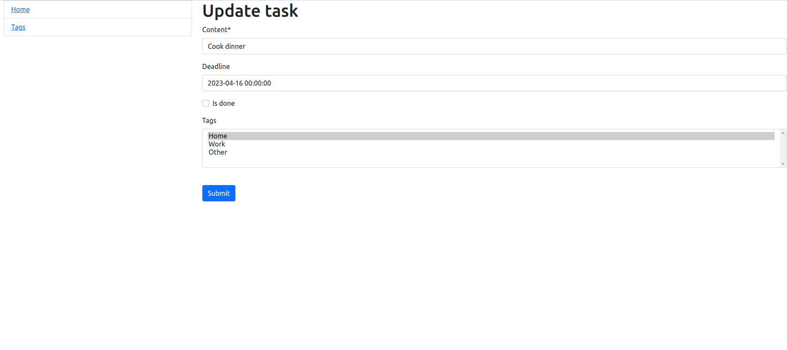

# ToDoList
It's a Django app to manage your task scheduler

## Installation
- git clone https://github.com/OmeLchDO/ToDoList
- python3 -m venv venv
- source venv/bin/activate
- pip install -r requirements.txt
- python manage.py migrate
- python manage.py runserver

